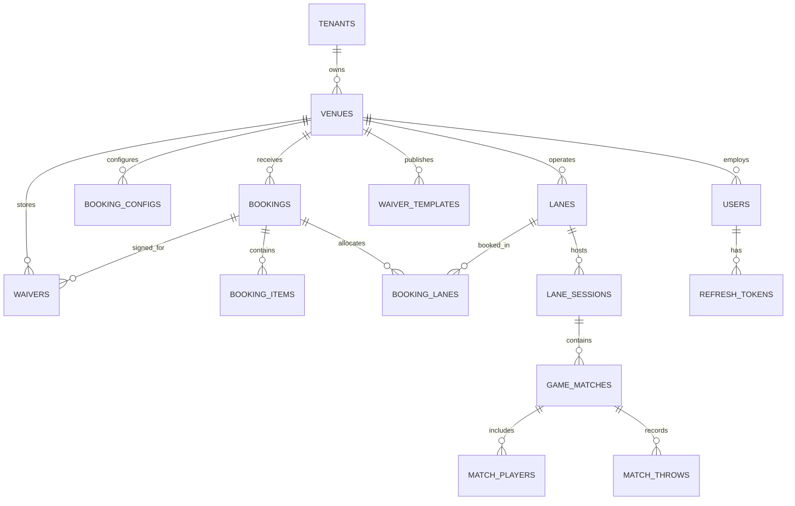

# Module 05: PostgreSQL Database Schema & Domain Data Models

## 1. Overview
The VenueAxe data layer is built on PostgreSQL 17+ using Entity Framework Core 10.0. Multi-tenancy is enforced through `tenant_id` partitioning on all core entities with Global Query Filters and indexed foreign keys. Dynamic configurations (booking themes, game rules, audit blobs) utilize native PostgreSQL `JSONB` with GIN indexing.

---

## 2. Entity Relationship Diagram (ERD)



---

## 3. Detailed Table Schema Definitions

### 3.1 Tenancy & Organizations
```sql
CREATE TABLE tenants (
    id UUID PRIMARY KEY DEFAULT gen_random_uuid(),
    name VARCHAR(150) NOT NULL,
    slug VARCHAR(80) UNIQUE NOT NULL,
    plan_tier VARCHAR(50) NOT NULL DEFAULT 'standard',
    stripe_customer_id VARCHAR(100),
    is_active BOOLEAN NOT NULL DEFAULT TRUE,
    created_at TIMESTAMPTZ NOT NULL DEFAULT clock_timestamp(),
    updated_at TIMESTAMPTZ NOT NULL DEFAULT clock_timestamp()
);

CREATE TABLE venues (
    id UUID PRIMARY KEY DEFAULT gen_random_uuid(),
    tenant_id UUID NOT NULL REFERENCES tenants(id) ON DELETE CASCADE,
    name VARCHAR(150) NOT NULL,
    slug VARCHAR(80) NOT NULL,
    address_line1 VARCHAR(255) NOT NULL,
    address_line2 VARCHAR(255),
    city VARCHAR(100) NOT NULL,
    state VARCHAR(50) NOT NULL,
    postal_code VARCHAR(20) NOT NULL,
    country VARCHAR(50) NOT NULL DEFAULT 'USA',
    phone VARCHAR(30),
    email VARCHAR(150),
    timezone VARCHAR(60) NOT NULL DEFAULT 'America/New_York',
    currency VARCHAR(3) NOT NULL DEFAULT 'USD',
    stripe_account_id VARCHAR(100),
    business_hours JSONB NOT NULL, -- weekly operating schedule
    branding_config JSONB NOT NULL, -- colors, logos, fonts
    is_active BOOLEAN NOT NULL DEFAULT TRUE,
    created_at TIMESTAMPTZ NOT NULL DEFAULT clock_timestamp(),
    updated_at TIMESTAMPTZ NOT NULL DEFAULT clock_timestamp(),
    UNIQUE(tenant_id, slug)
);
CREATE INDEX idx_venues_tenant ON venues(tenant_id);
```

### 3.2 Staff & Authentication (Owners / Staff Only)
```sql
CREATE TABLE users (
    id UUID PRIMARY KEY DEFAULT gen_random_uuid(),
    tenant_id UUID NOT NULL REFERENCES tenants(id) ON DELETE CASCADE,
    venue_id UUID REFERENCES venues(id) ON DELETE SET NULL,
    email VARCHAR(150) NOT NULL,
    password_hash VARCHAR(255) NOT NULL,
    first_name VARCHAR(100) NOT NULL,
    last_name VARCHAR(100) NOT NULL,
    role VARCHAR(50) NOT NULL, -- 'SuperAdmin', 'Owner', 'Manager', 'LaneMaster'
    phone VARCHAR(30),
    is_active BOOLEAN NOT NULL DEFAULT TRUE,
    last_login_at TIMESTAMPTZ,
    created_at TIMESTAMPTZ NOT NULL DEFAULT clock_timestamp(),
    updated_at TIMESTAMPTZ NOT NULL DEFAULT clock_timestamp(),
    UNIQUE(tenant_id, email)
);

CREATE TABLE refresh_tokens (
    id UUID PRIMARY KEY DEFAULT gen_random_uuid(),
    user_id UUID NOT NULL REFERENCES users(id) ON DELETE CASCADE,
    token_hash VARCHAR(255) NOT NULL UNIQUE,
    expires_at TIMESTAMPTZ NOT NULL,
    created_at TIMESTAMPTZ NOT NULL DEFAULT clock_timestamp(),
    revoked_at TIMESTAMPTZ
);
```

### 3.3 Lanes & Hardware Terminals
```sql
CREATE TABLE lanes (
    id UUID PRIMARY KEY DEFAULT gen_random_uuid(),
    venue_id UUID NOT NULL REFERENCES venues(id) ON DELETE CASCADE,
    tenant_id UUID NOT NULL REFERENCES tenants(id) ON DELETE CASCADE,
    lane_number INT NOT NULL,
    name VARCHAR(100) NOT NULL,
    max_throwers INT NOT NULL DEFAULT 6,
    is_active BOOLEAN NOT NULL DEFAULT TRUE,
    current_status VARCHAR(50) NOT NULL DEFAULT 'Available', 
    -- 'Available', 'Reserved', 'Active', 'Expiring', 'Turnaround', 'Maintenance'
    tablet_pairing_code VARCHAR(10),
    screen_pairing_code VARCHAR(10),
    tablet_device_token VARCHAR(255),
    screen_device_token VARCHAR(255),
    last_heartbeat_at TIMESTAMPTZ,
    created_at TIMESTAMPTZ NOT NULL DEFAULT clock_timestamp(),
    UNIQUE(venue_id, lane_number)
);
CREATE INDEX idx_lanes_venue_status ON lanes(venue_id, current_status);
```

### 3.4 Booking Configuration & Bookings
```sql
CREATE TABLE booking_configs (
    id UUID PRIMARY KEY DEFAULT gen_random_uuid(),
    venue_id UUID NOT NULL UNIQUE REFERENCES venues(id) ON DELETE CASCADE,
    tenant_id UUID NOT NULL REFERENCES tenants(id) ON DELETE CASCADE,
    min_party_size INT NOT NULL DEFAULT 2,
    max_party_size INT NOT NULL DEFAULT 30,
    slot_durations_minutes INT[] NOT NULL DEFAULT '{60, 90, 120}',
    turnaround_buffer_minutes INT NOT NULL DEFAULT 15,
    pricing_model VARCHAR(50) NOT NULL DEFAULT 'PerPerson', -- 'PerPerson', 'PerLane', 'Tiered'
    base_price_cents INT NOT NULL DEFAULT 3500, -- e.g. $35.00
    peak_price_cents INT NOT NULL DEFAULT 4500,
    deposit_type VARCHAR(50) NOT NULL DEFAULT 'FullPayment', -- 'FullPayment', 'FixedDeposit', 'PerPersonDeposit'
    deposit_amount_cents INT NOT NULL DEFAULT 0,
    editor_theme_json JSONB NOT NULL, -- styling, hero image, colors
    custom_fields_json JSONB NOT NULL, -- intake questions
    packages_json JSONB NOT NULL, -- packages and add-ons
    cancellation_policy TEXT,
    updated_at TIMESTAMPTZ NOT NULL DEFAULT clock_timestamp()
);

CREATE TABLE bookings (
    id UUID PRIMARY KEY DEFAULT gen_random_uuid(),
    venue_id UUID NOT NULL REFERENCES venues(id) ON DELETE CASCADE,
    tenant_id UUID NOT NULL REFERENCES tenants(id) ON DELETE CASCADE,
    booking_reference VARCHAR(30) UNIQUE NOT NULL, -- e.g. 'VA-94812'
    status VARCHAR(50) NOT NULL DEFAULT 'Confirmed', -- 'Pending', 'Confirmed', 'CheckedIn', 'Completed', 'Cancelled'
    guest_first_name VARCHAR(100) NOT NULL,
    guest_last_name VARCHAR(100) NOT NULL,
    guest_email VARCHAR(150) NOT NULL,
    guest_phone VARCHAR(30) NOT NULL,
    party_size INT NOT NULL,
    start_time TIMESTAMPTZ NOT NULL,
    end_time TIMESTAMPTZ NOT NULL,
    total_amount_cents INT NOT NULL,
    paid_amount_cents INT NOT NULL,
    stripe_payment_intent_id VARCHAR(120),
    payment_status VARCHAR(50) NOT NULL DEFAULT 'Paid',
    custom_intake_responses JSONB,
    notes TEXT,
    created_at TIMESTAMPTZ NOT NULL DEFAULT clock_timestamp(),
    updated_at TIMESTAMPTZ NOT NULL DEFAULT clock_timestamp()
);
CREATE INDEX idx_bookings_venue_time ON bookings(venue_id, start_time, end_time);
CREATE INDEX idx_bookings_reference ON bookings(booking_reference);

CREATE TABLE booking_lanes (
    booking_id UUID NOT NULL REFERENCES bookings(id) ON DELETE CASCADE,
    lane_id UUID NOT NULL REFERENCES lanes(id) ON DELETE CASCADE,
    PRIMARY KEY (booking_id, lane_id)
);
```

### 3.5 Digital Waivers
```sql
CREATE TABLE waiver_templates (
    id UUID PRIMARY KEY DEFAULT gen_random_uuid(),
    venue_id UUID NOT NULL REFERENCES venues(id) ON DELETE CASCADE,
    tenant_id UUID NOT NULL REFERENCES tenants(id) ON DELETE CASCADE,
    version_number INT NOT NULL DEFAULT 1,
    title VARCHAR(200) NOT NULL,
    body_text_markdown TEXT NOT NULL,
    sha256_hash VARCHAR(64) NOT NULL,
    is_active BOOLEAN NOT NULL DEFAULT TRUE,
    created_at TIMESTAMPTZ NOT NULL DEFAULT clock_timestamp()
);

CREATE TABLE waivers (
    id UUID PRIMARY KEY DEFAULT gen_random_uuid(),
    venue_id UUID NOT NULL REFERENCES venues(id) ON DELETE CASCADE,
    tenant_id UUID NOT NULL REFERENCES tenants(id) ON DELETE CASCADE,
    template_id UUID NOT NULL REFERENCES waiver_templates(id),
    booking_id UUID REFERENCES bookings(id) ON DELETE SET NULL,
    signer_first_name VARCHAR(100) NOT NULL,
    signer_last_name VARCHAR(100) NOT NULL,
    signer_email VARCHAR(150) NOT NULL,
    signer_phone VARCHAR(30) NOT NULL,
    date_of_birth DATE NOT NULL,
    is_guardian_signing BOOLEAN NOT NULL DEFAULT FALSE,
    minors_covered JSONB, -- array of { firstName, lastName, dateOfBirth }
    signature_image_png_base64 TEXT NOT NULL,
    signature_vector_svg TEXT,
    signed_at_utc TIMESTAMPTZ NOT NULL DEFAULT clock_timestamp(),
    expires_at_utc TIMESTAMPTZ NOT NULL,
    ip_address VARCHAR(45) NOT NULL,
    user_agent TEXT NOT NULL,
    created_at TIMESTAMPTZ NOT NULL DEFAULT clock_timestamp()
);
CREATE INDEX idx_waivers_search ON waivers(venue_id, signer_last_name, signer_email, signer_phone);
CREATE INDEX idx_waivers_booking ON waivers(booking_id);
```

### 3.6 Lane Sessions & Game Matches
```sql
CREATE TABLE lane_sessions (
    id UUID PRIMARY KEY DEFAULT gen_random_uuid(),
    lane_id UUID NOT NULL REFERENCES lanes(id) ON DELETE CASCADE,
    venue_id UUID NOT NULL REFERENCES venues(id) ON DELETE CASCADE,
    tenant_id UUID NOT NULL REFERENCES tenants(id) ON DELETE CASCADE,
    booking_id UUID REFERENCES bookings(id) ON DELETE SET NULL,
    session_title VARCHAR(150) NOT NULL, -- e.g. "Smith Birthday Bash"
    status VARCHAR(50) NOT NULL DEFAULT 'Active', -- 'Active', 'Paused', 'Completed'
    started_at TIMESTAMPTZ NOT NULL DEFAULT clock_timestamp(),
    expires_at TIMESTAMPTZ NOT NULL,
    ended_at TIMESTAMPTZ,
    active_roster JSONB NOT NULL -- array of thrower profiles { id, name, avatarColor, waiverId }
);

CREATE TABLE game_matches (
    id UUID PRIMARY KEY DEFAULT gen_random_uuid(),
    session_id UUID NOT NULL REFERENCES lane_sessions(id) ON DELETE CASCADE,
    game_type_id VARCHAR(50) NOT NULL, -- 'watl_standard', 'countdown_301', 'around_the_world', etc.
    game_config JSONB NOT NULL, -- target params, total rounds
    status VARCHAR(50) NOT NULL DEFAULT 'InProgress', -- 'InProgress', 'Finished', 'Aborted'
    winner_player_id VARCHAR(50),
    started_at TIMESTAMPTZ NOT NULL DEFAULT clock_timestamp(),
    completed_at TIMESTAMPTZ
);

CREATE TABLE match_throws (
    id UUID PRIMARY KEY DEFAULT gen_random_uuid(),
    match_id UUID NOT NULL REFERENCES game_matches(id) ON DELETE CASCADE,
    player_id VARCHAR(50) NOT NULL,
    round_number INT NOT NULL,
    throw_number_in_round INT NOT NULL,
    total_throw_sequence INT NOT NULL,
    target_zone VARCHAR(50) NOT NULL, -- 'Bullseye', 'Ring5', 'Ring4', 'Ring3', 'Ring2', 'Ring1', 'ClutchLeft', 'ClutchRight', 'Miss', 'Fault'
    normalized_x NUMERIC(6, 4), -- -1.0000 to +1.0000 relative to board center
    normalized_y NUMERIC(6, 4),
    is_clutch_called BOOLEAN NOT NULL DEFAULT FALSE,
    points_awarded INT NOT NULL,
    thrown_at_utc TIMESTAMPTZ NOT NULL DEFAULT clock_timestamp()
);
CREATE INDEX idx_match_throws_match ON match_throws(match_id, total_throw_sequence);
```
